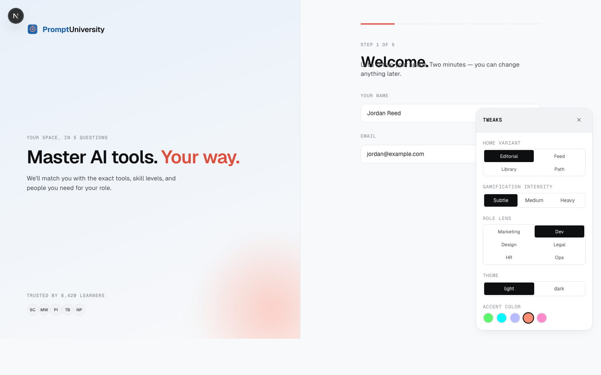

# Prompt University

> Peer-to-peer AI learning, structured.

**Live:** [obirimensah05.github.io/Code-Design-Hackathon](https://obirimensah05.github.io/Code-Design-Hackathon/)



---

## The problem, as one of your colleagues lives it

It's Tuesday. Sarah in marketing just cut her weekly newsletter time from four hours to forty minutes using a ChatGPT workflow she figured out on a flight.

Nobody else in her company will ever learn it.

The tip is in a Slack DM that'll be gone in 90 days. It won't make it into an internal wiki. It's too specific for a blog post. Meanwhile six of her colleagues are still spending four hours on the same task every week. That's **624 hours a year**, across one team, that won't get back.

The AI tools exist. The knowledge exists. The bridge between them is missing.

## What we built

Prompt University is that bridge: a community-driven hub where professionals share how they actually use AI in their roles — with short videos, walkthroughs, and prompt templates — scoped by role and skill level, trusted because they come from peers, and fast enough to matter on a Tuesday afternoon.

**Not a course platform.** Nobody finishes those.
**Not a chatbot wrapper.** The AI isn't the teacher — your peers are.
**Not another social network.** No follows, no likes.

Think: the magazine section of a good library, written by people doing the work.

## Try it in 30 seconds

**Online:** [Open the live demo](https://obirimensah05.github.io/Code-Design-Hackathon/) — runs entirely in your browser. No signup, no email, just the app.

**Locally:**
```bash
git clone https://github.com/obirimensah05/Code-Design-Hackathon.git
cd Code-Design-Hackathon
npm install
npm run dev
```
Then open [http://localhost:3333](http://localhost:3333).

## What's inside

| Screen | What it does |
|---|---|
| **Onboarding** | 5 questions, 2 minutes. Produces a tailored home. |
| **Home** | Four switchable variants — Editorial, Feed, Library, Path. Pick the one that fits your mental model. |
| **Browse** | Filter 25+ AI tools by role, level, and field. |
| **Tool detail** | 4 skill levels from Beginner to Expert, with videos per level. |
| **Video detail** | Watch, rate, and **try the lesson on Langdock** — a live AI model, same page. |
| **Leaderboard** | Weekly points by role + level. Dial-able intensity: subtle, medium, heavy. |
| **Share Knowledge** | Two-step upload. Paste a link, tag it, ship it. |
| **Tweaks panel** | Live controls for theme, accent, home variant, role lens, gamification. Visible on every screen. |

## Design principles

- **Warm editorial.** Magazine hierarchy. Public-library calm. Anti-anxiety for the AI-hesitant.
- **Voice in every pixel.** Empty states are invitations. Error messages help. Confirmations acknowledge.
- **Earned emotion.** No confetti on routine saves. A streak of seven gets a moment. A click does not.
- **Restraint.** Not every interaction is a feel moment. Motion carries meaning.

Full system: [DESIGN.md](DESIGN.md).

## Built with

- **Next.js 16** (App Router, Turbopack) — static export to GitHub Pages
- **React 19** — client-only, single-page
- **Tailwind v4** — tokens + utilities, but the design system is custom
- **TypeScript 5** — strict, with `.jsx` bodies for port convenience
- **Langdock** — AI model handoff for practice

No backend. No database. No auth. This is the MVP — every piece of state lives in your browser's localStorage, and the whole app is 107KB of JS + 2,000 lines of CSS.

## The docs

- [BRIEF.md](BRIEF.md) — the problem, the users, the focus areas
- [DESIGN.md](DESIGN.md) — tokens, type, motion, copy voice, anti-patterns
- [ARCHITECTURE.md](ARCHITECTURE.md) — code map, state model, static-export config
- [ROADMAP.md](ROADMAP.md) — what's shipped, what's next, what we won't build
- [AGENTS.md](AGENTS.md) — guide for whoever (or whatever) continues this

## Why this matters

If peer-to-peer AI learning gets even 5% of what's happening in Slack DMs and Twitter threads, millions of hours come back across every industry that isn't software engineering.

That's what we're after.

## Credits

Original design direction authored via Claude Design. Design system influenced by [impeccable](https://impeccable.style/) (Paul Bakaus), [interfaces-that-feel](https://github.com/mariespreitzer/interfaces-that-feel) (Marie Spreitzer), and the [designer-skills](https://github.com/Owl-Listener/designer-skills) collection (Marie Claire Dean). Full attribution in the vendored [skills/](skills/) directory.

Built for the Langdock Code × Design Hackathon.
